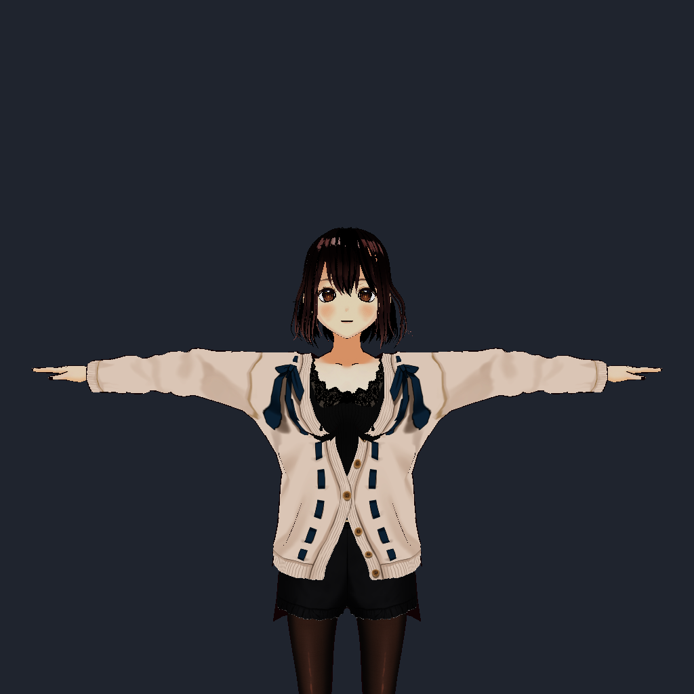

# VRMMetalKit

A high-performance Swift Package for loading and rendering VRM 1.0 avatars using Apple's Metal framework.

[](https://swift.org)
[](https://developer.apple.com)
[](LICENSE)
[](LICENSE-MODELS.md)

## Features

- **VRM 1.0 Specification Support** — full VRMC_vrm with VRM 0.0 fallback, MToon shader, 55 humanoid bones, 18 facial expressions, and complete metadata.
- **Animation System** — VRMA loader with rest-pose retargeting, humanoid bone mapping, non-humanoid node animation, and an AnimationPlayer with looping and speed control.
- **GPU-Accelerated Physics** — SpringBone XPBD simulation in Metal compute shaders at fixed 120Hz substeps, with sphere/capsule colliders.
- **Advanced Rendering** — MToon NPR with matcap, rim, and outline passes; GPU morph targets; skinning up to 256 joints; triple-buffered uniforms.
- **Performance & Debugging** — built-in metrics, three-level StrictMode validation, and zero-cost conditional debug logging.

## Installation

### Swift Package Manager

Add VRMMetalKit to your `Package.swift`:

```swift
dependencies: [
    .package(url: "https://github.com/arkavo-org/VRMMetalKit", from: "0.1.0")
]
```

Or in Xcode: **File → Add Package Dependencies** and enter the repository URL.

## Command Line Rendering

VRMMetalKit includes a command-line tool `VRMRender` for headless VRM rendering - perfect for batch processing, thumbnail generation, or CI/CD pipelines.



```bash
# Basic render
swift run VRMRender model.vrm output.png

# High-quality render with MSAA
swift run VRMRender --msaa 4 model.vrm output.png

# Custom resolution and camera position
swift run VRMRender -w 2048 -h 2048 --camera-pos 0,1.5,-2 model.vrm output.png
```

**Options:**
- `-w, --width <pixels>` - Output width (default: 1024)
- `-h, --height <pixels>` - Output height (default: 1024)
- `--camera-pos <x,y,z>` - Camera position (default: 0,1.5,2)
- `--camera-target <x,y,z>` - Camera look-at target (default: 0,1.5,0)
- `--msaa <samples>` - MSAA sample count: 1, 2, or 4 (default: 1)

## Documentation

Full API reference, integration guides, and migration notes:
**https://arkavo-org.github.io/VRMMetalKit/**

- **Getting Started** — install and first render
- **Loading VRM Models** — entry points, options, version detection
- **Rendering Avatars** — renderer config, MSAA, outlines
- **Animation and Retargeting** — VRMA loading and playback
- **ARKit Integration** — face and body driving
- **SpringBone Physics** — hair and cloth simulation
- **Strict Mode** — runtime validation
- **Migrating from VRM 0.x** — automatic 0.x compatibility notes

Or build locally:

```bash
make docs        # local preview server
make docs-static # static site under .build/docs
```

## Contributing

Contributions are welcome! Please read our [Contributing Guidelines](CONTRIBUTING.md) and [Code of Conduct](CODE_OF_CONDUCT.md).

**Quick checklist:**
1. Follow existing code style and architecture
2. Add tests for new features
3. Update documentation
4. Add Apache 2.0 license headers to new files
5. Use descriptive commit messages
6. Submit pull requests against `main` branch

For security issues, see [SECURITY.md](SECURITY.md).

## Licensing

VRMMetalKit uses a **dual licensing structure** to clearly distinguish between code and content:

### Source Code - Apache License 2.0

All source code (`.swift`, `.metal` files) is licensed under the **Apache License 2.0**.

```
Copyright 2025 Arkavo

Licensed under the Apache License, Version 2.0 (the "License");
you may not use this file except in compliance with the License.
You may obtain a copy of the License at

    http://www.apache.org/licenses/LICENSE-2.0

Unless required by applicable law or agreed to in writing, software
distributed under the License is distributed on an "AS IS" BASIS,
WITHOUT WARRANTIES OR CONDITIONS OF ANY KIND, either express or implied.
See the License for the specific language governing permissions and
limitations under the License.
```

See [LICENSE](LICENSE) for the full Apache 2.0 license text.

### VRM Models and Assets - VPL 1.0

VRM model files (`.vrm`) and 3D avatar assets follow the **VRM Platform License 1.0** (VPL 1.0) as defined by the VRM Consortium.

Each VRM model contains its own licensing metadata:
- **Author attribution** (required)
- **Commercial use permissions** (varies per model)
- **Modification rights** (varies per model)
- **Redistribution terms** (varies per model)

See [LICENSE-MODELS.md](LICENSE-MODELS.md) for details on VRM Platform License 1.0.

**Key Point**: When using VRMMetalKit, you must comply with:
1. **Apache 2.0** for the library code
2. **VPL 1.0** and model-specific licenses for any VRM models you use

### Attribution

VRMMetalKit implements the [VRM specification](https://github.com/vrm-c/vrm-specification) developed by the VRM Consortium. The VRM specification is licensed under Creative Commons Attribution 4.0 International (CC BY 4.0).

See [NOTICE](NOTICE) for complete attribution information.

## Credits

**Developed by**: [Arkavo](https://arkavo.org)

**Based on**: [VRM Specification](https://github.com/vrm-c/vrm-specification) by the VRM Consortium

**Built with**: Apple's Metal framework for high-performance GPU rendering

## Version History

See [CHANGELOG.md](CHANGELOG.md) for detailed version history.

### 0.1.0 (Current)

VRM 1.0 + VRMA support, MToon shading, GPU SpringBone physics, performance metrics, StrictMode validation, and the full DocC catalog.

---

**Questions?** Open an issue on GitHub.
