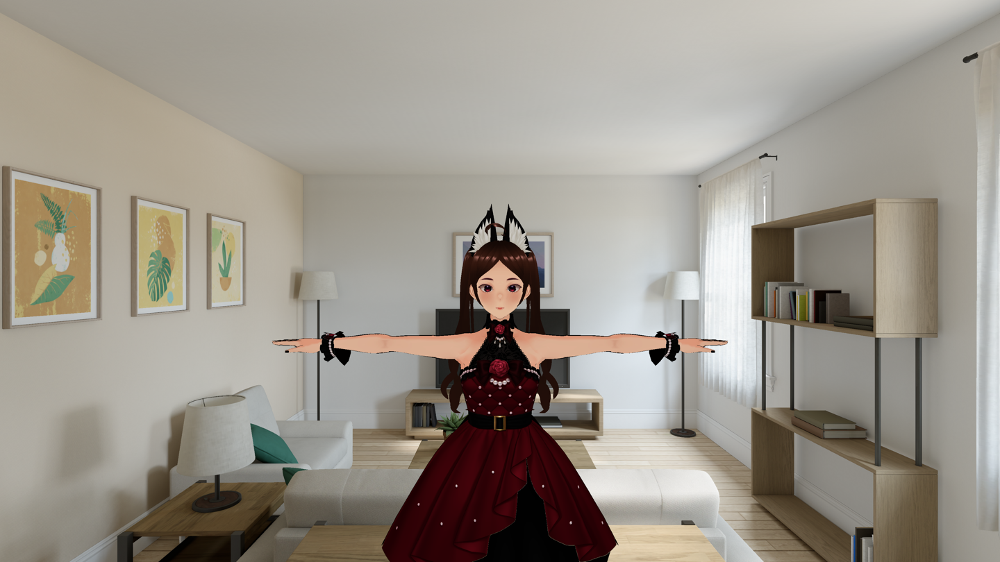

# VRMVisionHost

A minimal visionOS sample host that renders a VRM avatar into an **immersive
space** with Metal, through CompositorServices. Immersion is `.mixed`, so the
avatar composites over passthrough and shares the room with you rather than
replacing it — AR, not VR. There is no window.



*`AvatarSample_U` in the visionOS 26.5 simulator. The room is passthrough;
the avatar is VRMMetalKit rendering through CompositorServices.*

Progresses #399, which asks for a visionOS sample host. This provides the
host and a way to look at it by hand — it does not yet add the automated
render assertion that issue also wants.

## Credit

**This host is a thin app on top of [@enitimeago](https://github.com/enitimeago)'s
work — they built everything that makes visionOS rendering possible here.**

- **[#395](https://github.com/arkavo-org/VRMMetalKit/pull/395)** added the
  `xros` and `xrsimulator` metallib slices, the Makefile targets that build
  them, and the runtime selection that picks the right one. Without it there
  are no shaders to run on visionOS at all.
- **[#403](https://github.com/arkavo-org/VRMMetalKit/pull/403)** added
  `VRMRenderer.useReverseZ`. CompositorServices is reverse-Z, so this is not
  a nicety: with standard-Z compares against a `0.0` clear, the depth test
  rejects every fragment and the room stays empty. That PR also worked out
  the depth-bias polarity flip and pinned the whole thing with a
  pixel-identity test.

Both landed before this host existed, written against the spec rather than
against a running visionOS app. Everything below is the easy half.

## Running it

```bash
cd VisionHost
xcodegen generate
xcodebuild -project VRMVisionHost.xcodeproj -scheme VRMVisionHost \
  -destination 'platform=visionOS Simulator,name=Apple Vision Pro,OS=26.5' \
  -configuration Debug -derivedDataPath ./DerivedData build

xcrun simctl boot 'Apple Vision Pro'
xcrun simctl install booted DerivedData/Build/Products/Debug-xrsimulator/VRMVisionHost.app
xcrun simctl launch --console-pty booted org.arkavo.VRMVisionHost
xcrun simctl io booted screenshot /tmp/vision.png
```

## GPU bench (xrsimulator)

Same stereo offscreen path as `VRMBenchmark --mode visionos`, plus a compositor-loop sample, on the simulator Metal device:

```bash
cd VisionHost
xcodegen generate
xcodebuild -project VRMVisionHost.xcodeproj -scheme VRMVisionHost \
  -destination 'platform=visionOS Simulator,name=Apple Vision Pro,OS=26.5' \
  -configuration Release -derivedDataPath ./DerivedData build

xcrun simctl boot 'Apple Vision Pro'
xcrun simctl install booted DerivedData/Build/Products/Release-xrsimulator/VRMVisionHost.app
SIMCTL_CHILD_VRM_VISIONOS_BENCH=both \
  xcrun simctl launch --console-pty booted org.arkavo.VRMVisionHost
```

JSON lands in the app Documents container (`bench-visionos-xrsimulator.json`). This is still the simulator GPU, not a Vision Pro.

The Xcode project, the generated `Info.plist`, and `DerivedData/` are all
build products and are gitignored — `xcodegen generate` recreates them.

To confirm the avatar is genuinely anchored in the room rather than pinned
to the viewer, move the simulator viewpoint between two screenshots (the
viewpoint controls sit at the bottom right of the simulator window). A
world-anchored avatar slides across the frame and changes aspect; a
head-locked one would not move.

## How it works

- **Immersive, not windowed.** The `Info.plist` declares
  `CPSceneSessionRoleImmersiveSpaceApplication` as the preferred scene
  session role, so the app opens straight into an `ImmersiveSpace`
  containing a `CompositorLayer`. No `WindowGroup` is ever created.
- **Mixed, not full.** The immersion style is `.mixed`, so passthrough stays
  visible behind the avatar. This works because the render pass clears
  colour to *transparent* black — an opaque clear would paint over
  passthrough and give back the fully immersive look.
- **Reverse-Z.** CompositorServices works in reverse-Z: the SDK documents
  `cp_drawable_get_depth_range` as returning "values in reverse-z ordering,
  with the value for the far plane in the vector's `x` property and the
  value for the near plane in the vector's `y`". The host therefore sets
  `VRMRenderer.useReverseZ` and clears depth to `0.0`. Without both, the
  depth test rejects every fragment and nothing appears.
- **One simulation, one raster per view.** Each view supplies its own
  projection from `drawable.computeProjection(viewIndex:)` and a view
  matrix derived from the device anchor. The host calls
  `VRMRenderer.encodeCompositorViews(commandBuffer:views:)`, which runs
  morphs, SpringBone, and the inflight-slot wait once, then encodes each
  eye. That is the preferred submit path — calling `drawOffscreen` once
  per eye still works, but it double-steps physics and consumes two
  triple-buffer slots. Attachments are selected via `view.textureMap`,
  so the code works under either the `layered` or `dedicated` layout.
- **Placement.** The avatar stands 1.5 m in front of the viewer. Floor
  height comes from the first tracked device pose rather than assuming the
  session origin is on the floor — in the simulator the origin is the head
  position, so assuming otherwise puts the viewer eye-to-eye with the
  avatar's shins.
- **Lighting is set explicitly.** VRMMetalKit does not supply default
  lights; a renderer with none draws the avatar black.
- **LookAt tracks the wearer's eyes.** Each compositor view is one eye
  pose. The host aims at the midpoint of those origins in avatar space
  (`VRMLookAtTarget.user`) and **turns the head** toward that point
  (clamped ~±50° yaw). AvatarSample_U authors bone look-at with only
  8–12° of eye travel — eyes alone still read as staring forward once
  the avatar is off to one side. Residual aim stays on the eye bones.
  Raw gaze (where the wearer is looking) is not available to a
  third-party Metal host.
- **Playlist + blink.** `AvatarDirector` cycles bundled standing VRMA
  clips (idle, look-around, greet, relax, think, in-place `VRMA_01`)
  with a 0.75 s slerp crossfade, and blinks on the render thread. The
  offscreen GPU bench still uses its own model and a single clip;
  compositor sampling after that includes the director, so animation
  cost is in those numbers.
- **SpringBone + app-layer gravity.** AvatarSample joints author
  `gravityPower = 0`; bind direction for a high ponytail is straight up.
  The host sets `springBoneGlobalParams.gravity = (0, -2, 0)` — the same
  `ExternalForce` a real app is expected to provide — then warms physics
  up so hair drapes before the first frame.

## Known limits

- Spring-bone and morph compute run once per compositor frame (via
  `encodeCompositorViews`). Older hosts that called `drawOffscreen` per
  eye stepped physics twice. The GPU bench loads a separate model so it
  cannot leave the live rig in a posed rest state.
- No gesture input, no foveation, no MSAA (drawable textures are
  single-sampled).
- Only tested in the simulator. The floor-height derivation in particular
  assumes the device pose starts at eye height, which may differ on
  hardware.
