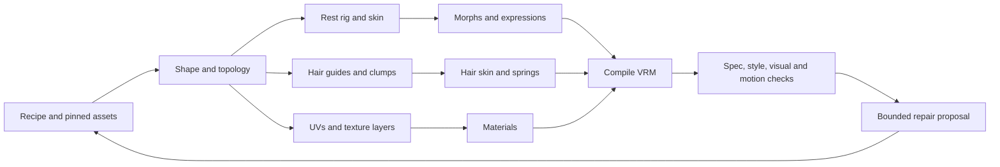

<!--
Copyright 2026 Arkavo
Licensed under the Apache License, Version 2.0 (the "License");
you may not use this file except in compliance with the License.
You may obtain a copy of the License at https://www.apache.org/licenses/LICENSE-2.0
Unless required by applicable law or agreed to in writing, software distributed
under the License is distributed on an "AS IS" BASIS, WITHOUT WARRANTIES OR
CONDITIONS OF ANY KIND, either express or implied. See the License for the
specific language governing permissions and limitations under the License.
-->

# Proposal: VRMAuthor — autonomous VRM authoring CLI

Status: implemented. All 35 v1 commands are registered and
runnable; none is production-eligible yet, because evidence admission, inspection
records and the visual judge remain open. Reserved designs stay unimplemented.  
Date: 2026-09-10. Proposed executable: `vrm-author`. Protocol: `vrmauthor/1`.  
Primary output: a self-contained VRM 1.0 avatar plus its editable authoring project.

Build a deterministic authoring engine that an AI agent can discover, operate, inspect,
and revise without a graphical editor. V1 compiles an original parametric template
into geometry, textures, a complete humanoid rig, working expressions, hair and
secondary motion. An agent supplies structured intent and edits
the documented v1 controls. Arbitrary topology and solver operations are reserved.

The proposed interface separates a bounded v1 release from reserved research:

| Document | Contract |
|---|---|
| [Verification contract](verification.md) | Primary coordination artifact: pinned oracles, evidence levels, per-command required evidence, v1 judge/evaluator, staging |
| This proposal | Architecture, autonomous workflow, algorithms, delivery and acceptance |
| [Command catalog](commands.md) | V1 command allowlist, common arguments and results |
| [Parameter catalog](parameters.md) | V1 controls, typed payloads and supported VRM fields |
| [Reserved commands](reserved.md) / [parameters](reserved-parameters.md) | Advanced contracts; independently qualified and excluded from the initial release gate |
| [Worked authoring session](example.md) | Concrete requests for a styled avatar, hair, expressions and correction loop |

**Verification is the primary artifact.** Stage A establishes the shared contracts,
registry and executable acceptance packs before parallel handler implementation.
Every catalog command carries evidence status, scope and runnable state; a schema
entry is useful coordination data but never a claim that its handler works. Stage B
remains the first complete v1 release. The initial release boundary limits what is
certified, not how many operations agents may implement concurrently.

## 1. Scope and reference hierarchy

Use four distinct authorities, recorded in every relevant control descriptor:

1. **Format requirements:** pinned glTF 2.0 and VRM extension schemas plus semantic
   validation. Schema validity alone cannot prove a usable rig, visible expression,
   suitable topology or a good render. The [VRM specification](https://github.com/vrm-c/vrm-specification/tree/master/specification)
   separates core avatar data, MToon, spring bones and node constraints.
2. **Style targets:** the in-tree VRoid-lineage
   [profile](../../style/profiles/vroid-lineage-anime.json) (v0.1.0),
   [linter](../../../scripts/style_lint.py) and
   [corpus manifest](../../style/corpus/vroid-lineage-anime.manifest.json),
   originating in PR #436. The content hash is the pin and no commit is; the
   authoritative table is [verification.md §2](verification.md):
   - `scripts/style_lint.py` sha256 `01679f040546fa76b6c4b8f6c84244388201ad04f0f449157c5ec634716b5881`
   - `docs/style/profiles/vroid-lineage-anime.json` (v0.1.0) sha256 `7eeb1f41bada650d39b7c32a31c273bbd889cca22d390164b8a7dd9b1f9c1f35`
   - `docs/style/corpus/vroid-lineage-anime.manifest.json` sha256 `b393eb0c8c49050caab772f8bdd6ad884d6dd027ad310249ae9805a22b1a8cb6`

   Bounds are empirical targets; fingerprints never become generation constraints. The
   profile contains no base mesh, topology basis, texture library or inverse shape solver.
3. **VRoid workflow coverage:** the documented face, body, hair, outfit, accessories,
   texture, expression and export workflows. Public documentation describes editable
   categories, but does not provide an exhaustive, versioned numeric slider API.
4. **Native authoring controls:** this proposal's independently defined shape parameters,
   procedural generators and mesh tools. Their names, ranges and defaults are our API,
   not claims about pixiv's internal implementation.

V1 acceptance is coverage of the documented workflow categories through native
controls and curated templates. Maintain an **internal coverage tracker** for the
reference documentation, representative UI workflows, template coverage and known
gaps. It helps prioritize development; it is an internal tracker, not a public pixiv
parity scorecard, and does not by itself justify a claim of exact slider parity. Agents track each
VRoid release internally: record release/source hashes, UI/item-control changes,
verified/approximate/unmapped mappings and regression evidence. Unknown private
formats or undocumented behaviour remain unknown regardless of available throughput.
`.vroid`, `.vroidcustomitem`, XAvatar and XRoid are separate formats; native equivalents
do not imply round-trip support. Their adapters remain reserved pending independent tests.

VRoid documents [17 face categories](https://vroid.pixiv.help/hc/en-us/articles/4406164546969),
[procedural/freehand hair editing](https://vroid.pixiv.help/hc/en-us/articles/900005678786),
[hair bounce controls](https://vroid.pixiv.help/hc/en-us/articles/900006910023),
[layered outfit templates](https://vroid.pixiv.help/hc/en-us/articles/4405497325721)
and [item-dependent accessory parameters](https://vroid.pixiv.help/hc/en-us/articles/900006965863).
The v1 workflow matrix below bounds this coverage; reserved designs retain lower-level geometry.

## 2. Product decisions

| Decision | Proposal |
|---|---|
| Host | Linux x86-64/arm64 and macOS arm64 CPU authoring required in v1; Metal preview on macOS 26+ |
| Implementation | Independent cross-platform Swift package for CLI/core; optional VRMMetalKit preview adapter; versioned C ABI for native geometry |
| CPU/GPU boundary | Project editing, mesh generation, serialization and spec validation work without Metal; render checks run on a declared local or remote renderer; Linux CPU core cannot import Metal or Apple-only frameworks |
| Source asset | Editable native recipe with an original, redistributable parametric base/template pack; imported VRMs are optional inputs |
| Portability | `portable-vrm1` is the v1 export target; extra extension/export targets are reserved |
| Legacy | VRM 0.x/1.0 inspection and preservation-oriented import in Stage B; legacy export is reserved, with mandatory loss reports |
| Execution | Noninteractive JSON requests/responses, bounded synchronous calls, stable IDs, atomic revisions and deterministic seeds; persistent jobs reserved |
| Asset generation | Deterministic mesh/texture generators first; optional model-generated assets enter through hashed imports with provenance |
| Ownership | Keep source assets, edit history, compiled artifacts and QA evidence separate |
| Publishing | Produce local files; uploading to a platform is outside this CLI's authoring contract |

The current [VRMBuilder](../../../Tests/VRMMetalKitTests/Authoring/VRMBuilder.swift)
is test-only: it uses primitive geometry, name-only expression placeholders and does
not provide the required hair, texture, skinning and spring export pipeline. Reuse its
fixtures and serialization lessons, not its public API as the final architecture.
The current package declares Swift tools 6.3; implementation must follow the checked-in
package's toolchain rather than assuming an older version from project prose.

## 3. Project model and compilation

```text
avatar.vrmauthor/
  project.json          # IDs, metadata, recipes, object graph, profile references
  lock.json             # tool/schema/profile/template/backend hashes and seeds
  assets/sha256/...     # source meshes, texture layers, curves, reference images
  revisions/...         # immutable edits and correspondence/remap data
  builds/<hash>/        # compiled glTF/VRM, stable-ID-to-export-index map
  reports/<job>/        # numeric checks, contact sheets, motion traces, repair plans
```

Source geometry has a polygon/triangle soup representation with explicit adjacency,
persistent vertex/edge-use/face IDs and per-corner attributes. A manifold editable patch
may additionally carry a half-edge view; the importer never requires one globally.
Preserve overlapping eye/mouth layers, disconnected shells, double-sided cards,
T-junctions and genuinely non-manifold edges without forced welding or hole filling.
Overlapping independent meshes alone do not imply non-manifold topology. Operations
requiring manifold input report the affected patch and offer an explicit conversion
plan; the original soup survives. Export geometry is triangulated indexed glTF. Never use glTF array indices
or material names as project identity. Imported arrays map to stable IDs immediately;
legacy `materialProperties[i]` maps to `materials[i]`. Duplicate names are legal.

Compilation is an explicit dependency graph:



Changing topology invalidates correspondences, UVs, weights, morph deltas and landmarks.
An operation either transfers them with an error report or marks dependent objects
stale. Builds reject stale dependencies. Editing a haircut must invalidate its generated
bone axes and weights; moving a shoulder must invalidate clothing fit and colliders.
The system cannot leave apparently valid but obsolete derived data behind.

### Deterministic artifact contract

Each result records exact input revisions and hashes. The v1 `portable-strict/1`
backend must produce byte-identical **unsigned CPU build artifacts** on the Linux and
macOS CI matrix for identical locked inputs. The lock includes templates, schemas,
algorithms, codecs, the full supported platform toolchain matrix and dependency versions.
The same lock is used across platforms; host-specific execution receipts stay outside
the canonical build inputs. JSON integer inputs are limited to 53 exact bits; larger
identifiers are strings, never rounded numbers.

- Canonical JSON uses [RFC 8785](https://www.rfc-editor.org/rfc/rfc8785) key ordering and number serialization, UTF-8 without
  BOM, no insignificant whitespace, no duplicate keys or nonfinite values. Preserve
  input Unicode strings; do not silently normalize names. Normalize numeric negative
  zero. Hash the canonical bytes, not pretty-printed output.
- Emit little-endian IEEE-754 binary32 geometry, round-to-nearest ties-to-even;
  quantize once at defined stage boundaries. Stable object-ID ordering determines
  arrays, accessor layout and material indices. Fixed traversal and reduction order,
  deterministic triangulation tie-breaks and a versioned PRNG are required.
- Strict CPU numerics disable fast-math, FMA contraction, autovectorization and
  Accelerate/BLAS/GPU paths. Pin scalar transcendental implementations and explicit
  subnormal handling; platform `libm` is not a reproducibility guarantee. Parallel
  workers may process independent objects but merge in stable order. A backend that
  fails cross-platform hash fixtures cannot advertise `portable-strict/1`.
- GLB uses canonical JSON plus space padding and zero-filled BIN padding to 4-byte
  alignment. Texture encoders use pinned versions/settings, stable row order and no
  timestamps or incidental metadata. No source path, wall clock, request ID or random
  UUID enters a build artifact. Content-derived IDs include parent/local identity to
  keep identical sibling objects distinct.
- Signed C2PA envelopes, certificate chains, timestamps, job/inspection logs and GPU
  images have separate hashes; they are outside byte-identity guarantees. The signed
  envelope binds the already frozen unsigned VRM hash, avoiding circular hashes.

GPU image/physics comparisons use declared tolerances and record device/driver/backend
identity; cross-device pixel identity is not promised. CI compares fixture bytes across
all supported CPU platforms, including thread-count changes and clean rebuilds.

## 4. Agent interaction contract

`describe` exposes commands, JSON Schemas, examples, cost estimates, capability status
and prerequisites. `control describe` additionally supplies legal/recommended ranges,
units, default, side/mirroring behaviour, affected objects, dependencies and upstream
provenance. Every field accepted by `--request` must be discoverable; there are no
unlisted expert-only switches or GUI-only operations.

An agent can use short-lived CLI calls or `serve --stdio` with newline-delimited JSON-RPC 2.0 messages. Both invoke identical handlers. Bulk geometry travels by artifact path/hash, never
as thousands of coordinates in a conversational response. Responses include previews,
small deltas and artifact links. Stdout contains only structured results; logs go to
stderr. Async jobs expose progress, cancellation, resume and resource bounds.

Mutations are atomic. They take `expectedRevision` and `requestId`; a successful retry
of the same request returns the original result. A changed payload under the same ID
is an error. A failed mutation leaves the project unchanged. `--dry-run` returns the
exact edit plan and invalidations. Restoring a revision creates a new revision rather
than deleting history. Imported content is data, not executable instructions.

### Transport and delivery scope

Use [JSON-RPC 2.0](https://www.jsonrpc.org/specification): `jsonrpc`, `id`, `method`,
`params`, and exactly one of `result`/`error` for responses. CLI `recipe apply` maps to
`recipe.apply`; its `vrmauthor/1` result is wrapped in RPC `result`. Protocol/request
errors use RPC errors; domain failures retain the structured application result.
RPC `id` correlates messages; `params.requestId` is the persisted idempotency key.
Reject mutating notifications because they cannot return a revision or receipt.

V1 executes bounded synchronous requests and retains the contract above. Persistent
async jobs and multi-request transactions have shared schemas and acceptance contracts
in Stage A; runtime admission follows their own evidence gates. Unsupported flags
remain absent from executable v1 schemas. Each mutation remains
an atomic transaction and dry-run never consumes its request ID. Store the receipt and
revision together durably, including across restart. A dry-run plan includes its
base revision and hash; apply may require `expectedPlanHash` and rejects changed plans.

`serve --stdio --protocol mcp` is a v1 adapter over the same registry, pinned initially
to MCP 2025-06-18 with version negotiation. It implements initialization, capability
negotiation, `tools/list`, `tools/call`, structured tool results and stderr-only logs.
JSON-RPC alone is not MCP compatibility; test the adapter with an independent client.
See [MCP tool requirements](https://modelcontextprotocol.io/specification/2025-06-18/server/tools).
An [A2A adapter](https://a2a-protocol.org/latest/specification/) is reserved and needs its own agent discovery, task lifecycle and
artifact mapping; shared handlers reduce duplication but do not eliminate that work.

Example result and actionable failure:

```json
{
  "protocol": "vrmauthor/1", "requestId": "fit-004", "status": "failed",
  "revisionBefore": 18, "revisionAfter": 18,
  "artifacts": [], "warnings": [],
  "errors": [{
    "code": "GARMENT_PENETRATION", "objectId": "garment:jacket",
    "path": "/fit/minClearanceM", "observed": -0.004, "required": 0.002,
    "message": "Left sleeve penetrates the upper arm in arms-down pose.",
    "suggestedCommands": ["control set", "recipe apply", "qa run"],
    "artifact": "reports/fit-004/left-sleeve.png"
  }]
}
```

## 5. Autonomous creation loop

1. Discover available commands, template/control schemas and renderer capabilities.
2. Convert the user's brief into an explicit `Recipe`: proportions, face, hair,
   garments, palette, expression requirements, output target and resource limits.
3. Resolve the base/template pack, metadata and asset references. Lock all inputs.
4. Build body/head topology, eye and mouth layers, full humanoid rig and UVs.
5. Instantiate the bob preset, fitted garment templates and rigid accessories.
6. Generate texture layers and MToon materials with explicit role IDs.
7. Generate actual morph deltas and expression bindings. Configure gaze and first person.
8. Generate hair/cloth chains and colliders, then compile a draft VRM.
9. Run spec, style, geometry, expression and motion checks plus canonical renders.
10. Inspect numeric findings and image artifacts. Propose bounded repairs only to
    permitted controls, evaluate candidate revisions, and retain the best valid result.
11. Reimport the exported file, rerun essential checks, and deliver VRM, source project,
    manifest, contact sheet and report.

Stopping criteria are explicit: all required checks pass, prescribed views/motions have
evidence, no unresolved critical intersections or inert required expressions remain,
and every required visual artifact has a valid inspection record or logged scoring pass
bound to its hash, revision and QA scenario (see §9). On exhausted iterations, time, GPU
budget or an unsatisfiable target, deliver the best draft with `incomplete` status and
the remaining blockers. A style pass alone cannot mark the task complete.

### Illustrative end-to-end invocation

These are proposed commands. The [worked session](example.md) defines the input
files and inspection/provenance steps in detail.

```bash
vrm-author describe --format json
vrm-author project init --dir ./avatar.vrmauthor --template native-anime-v1 --seed 42
vrm-author recipe apply --project ./avatar.vrmauthor --request brief.json
vrm-author build --project ./avatar.vrmauthor --out ./draft.vrm
vrm-author qa run --project ./avatar.vrmauthor --file ./draft.vrm --suite spec+style --out ./qa-slice
vrm-author export vrm --project ./avatar.vrmauthor --out ./avatar.vrm
```

After Stage A freezes contracts and acceptance packs, Stage B uses this integration
scenario while handlers proceed in parallel. It is a continuously exercised test,
not a sequencing rule that postpones the broader registry. Completed delivery also
requires the `authoring-v1` gate, final-byte verification, inspection and signatures.

`recipe apply` materializes the full dependency graph, including required expression
morphs and spring generation; it is not just a JSON settings patch. `build` evaluates
stale *procedural* nodes automatically, but cannot silently invent correspondences for
edited imported topology. Generated objects expose only the editable fields listed in the v1 schemas; arbitrary
vertex, guide and topology editing remains reserved.

## 6. Template production and reserved geometry

Use an original quad-based face/body template with semantic regions, canonical
landmarks, crease tags, expression loops and a complete rig. A procedural primitive
assembler alone is insufficient; procedural construction must also produce semantic
eyelid/lip loops, deformation bases and the acceptance evidence for a production face. A template pack must ship meshes, morph
bases, UV layouts, bind data, control response functions and executable tests together.

### Template construction, provenance and acceptance budget

The default path is a reproducible procedural template built from declared primitives,
semantic surface construction and explicit deformation functions. Agents may fit it
to published aggregate profile bounds and iterate using development renders. They
must not use withheld corpus assets as generation inputs. Human art review or authored
assets may supplement this path if their source and terms are recorded; a commission
is not a prerequisite, and a fixed artist-week estimate is not the scheduling model.

The template itself ships with a C2PA manifest and a replayable construction bundle:
generator source/commit and dependency hashes, primitive definitions, operation DAG,
seeds, control-fit objectives and profile hash, all imported ingredient hashes and
terms, intermediate/final meshes, UV/bind/morph data, model generation records where
available, and validation/inspection reports. Rebuild the unsigned pack from that
bundle in an isolated environment and compare hashes before signing. Sign the frozen
pack and make it an ingredient in every generated avatar's provenance graph.

This provides auditable evidence of the recorded construction and declared inputs.
It does **not** prove that a model's learned priors contain no influence from other
assets, or establish originality and redistribution rights merely by signing bytes.
No template may claim known-clean training data without supporting evidence. Preserve
unknown model lineage and obtain explicit rights declarations for code and ingredients;
conflicting or unresolved required rights block distribution. C2PA authenticates
claims and bindings, not a legal conclusion about them (see the provenance policy in §9).

| Deliverable | Acceptance evidence | Capacity to budget |
|---|---|---|
| Semantic body/head and globe eyes | Primitive replay, silhouette/eye clearance, loop and opening checks | CPU build and cross-platform replay minutes |
| UV/rig/control/morph basis | Endpoint combinations, blink/lip closure, visemes, pose deformation | CPU sweeps plus independently judged contact sheets |
| Bob/outfit/accessory pack | Root attachments, template fit, weights, spring motion and occlusion | Motion frames, collision samples and Metal passes |
| Rights and pack provenance | Ingredient ledger, replay hashes, signed pack and rights attribution | Independent provenance review and validator runs |
| Release qualification | Frozen acceptance packs, withheld-family evaluation and consumer matrix | Judge calls, held-out evaluations and scarce GPU minutes |

Stage A measures these costs on representative fixtures, then records per-operation
CPU/GPU minutes, evaluator calls, queue latency, memory and retry limits in the budget.
Expand worker capacity from observed demand. A pack that passes easy numeric targets
but lacks anatomical/visual evidence cannot leave Stage B, however quickly it was built.
Fleet scheduling, per-project evaluation budgets and held-out evaluation are
[reserved verification requirements (Stage C)](reserved.md#reserved-verification-requirements-stage-c).

### V1 eye decision

Use **sculpted globe/ellipsoid eyeballs**, with separate sclera, iris/pupil and highlight
surfaces, rigid eye weights, and explicit left/right eye bone pivots. The template
provides eyelids that close over these surfaces and calibrated gaze limits. V1 native
export uses `lookAt.type=bone`; iris texture placement is static, with no UV-scroll
requirement. Eye size and spacing regenerate pivots, lids and clearance checks together.
This is a native anime construction, not a claim to reproduce VRoid's eye internals.
Curved eye-plane authoring and expression-driven gaze are reserved template variants;
imported expression gaze can be preserved but is not converted silently into globes.

### Reserved geometry and dependency boundary

Subdivision with creases, constrained retopology, ARAP/cage deformation, SDF modelling,
booleans, remeshing and shrinkwrap live under `reserved`. None is needed to compile
v1's fixed-topology shape basis. Preserve openings and layer boundaries during future
repair; do not automatically cap mouth openings or hair-card borders.

| Backend | Decision | Integration |
|---|---|---|
| [Manifold](https://github.com/elalish/manifold) | Apache-2.0 reference/candidate wrapper; compare with owned backend verification cost | Versioned C ABI shim; explicit manifold-input precondition |
| [OpenSubdiv](https://opensubdiv.org/docs/license.html) | Subdivision reference/candidate wrapper; upstream license is **TOST**, not plain Apache-2.0 | Pin release and actual license/NOTICE in dependency inventory before adoption |
| [libigl](https://libigl.github.io/) | Optional MPL-2.0 core only; exclude GPL modules and CGAL boolean paths | No blanket import; dependency/license audit per selected module |

Choose a **C ABI shim**, opaque handles and explicit owned-buffer/free functions rather
than exposing C++ templates across Swift boundaries. Translate exceptions to typed
errors; pin ABI versions and test on Linux/macOS. Dependency provenance, notices and
an SBOM ship with releases. Optional geometry kernels do not gain deterministic status
without the cross-platform fixture tests in §3. Choose wrapping versus ownership
per operation using the verification-cost record in
[reserved.md](reserved.md#reserved-verification-requirements-stage-c);
agent implementation speed alone is not a selection criterion. An owned boolean or
subdivision backend must pass the same frozen oracle plus degeneracy, robustness and
differential cases. Wrappers also require these tests; library reputation is not a pass.

The following transfer and deformation techniques remain reserved except for the
precomputed template correspondences and standard skinning needed by v1.

Transfer weights and morphs through explicit barycentric/cage correspondences, with
distance, normal-angle and region restrictions. Generate or preserve eyeball pivots,
eye clearance, inner-mouth geometry, teeth and tongue. Eyelids must close over the
eye surface without collapsing the iris or moving teeth. Retest expression combinations
after every shape change. Use [MikkTSpace](https://github.com/mmikk/MikkTSpace) tangent
generation for consistent tangent-space normal maps.

Author in metres, Y-up, +Z forward for canonical VRM 1.0 projects. Nodes, surfaces,
curves and collider data always declare their space. Convert VRM 0.x once at the import
boundary. Rest pose and animation rest are independent immutable inputs; retargeting
uses `modelRest * inverse(animRest) * animRotation`. Rebinding geometry is a deliberate
operation that updates inverse binds, weights/correspondences and affected morphs.

Skinning supports automatic weights, manual sparse edits, smooth/normalize/prune,
locked influences, garment transfer and pose-driven corrective shapes. Export the
target's permitted linear-blend weights; dual-quaternion or simulation deformation
used during authoring must be baked or reported as unsupported, not mislabeled as
standard glTF skinning. Reference poses include arms-down, shoulder elevation, elbow
flexion, squat, seated, neck extremes and finger closure.

## 7. Hair construction: v1 preset and reserved solvers

V1 ships one bob preset with calibrated length, width, tip bend, bang clearance,
colour/highlight and standard spring controls. It compiles provenance-recorded clump guides
and baked fitting data; root count, guide topology and bone layout are pack constants.
The broader strand, braid, curl, freehand guide and avoidance algorithms below are
reserved designs, not requirements to complete v1.


Represent hair as scalp attachment + group guide surface + editable centre curves +
cross-section/width/thickness/twist profiles + material/UV assignment + optional rig.
Scalp attachments use triangle barycentric coordinates with a topology correspondence,
not nearest vertices or names. Clumps and root/tip direction have persistent IDs.

Support card ribbons, folded ribbons, lenticular clumps and polygonal tubes. Sample
by arc length and curvature; use parallel-transport frames to avoid twist flips. A
seeded density field places roots with minimum separation. Local guide fields control
parting, bangs, side locks, crown, nape, ahoge, extensions, ponytails, buns and braids.
Curl/wave generators expose radius, pitch, phase, taper and handedness. Braids use
explicit carrier curves and crossing order; scalp avoidance must not flatten their
silhouette. The parameters and editable output are retained after generation.

Generate longitudinal UVs and a reusable atlas; independently control root/tip colour,
shade, highlight band, strand streaks and alpha coverage. Atlas packing must preserve
material roles and layer ordering. Simplify by reducing curvature samples and merging
compatible clumps while preserving silhouette, root coverage and tip separation.
Measure scalp visibility, card flips, self-intersections, face occlusion, rest-body
clearance and movement clearance. Curves are authoring assets; portable VRM contains
their baked triangle meshes, weights and standard spring bones.

VRoid's documented grouping, freehand/procedural editing and bounce operations inform
the user-facing concepts. Our guide construction, tessellation and solver parameters
are proposed native designs, not reverse-engineered numeric equivalents.

## 8. Spring bones, cloth and collider strategy

Export standard `VRMC_springBone` chains and sphere/capsule colliders. Generate bones
along clump centre curves, clustered hair bundles or garment strips; let the agent edit
every joint and membership. Keep root attachment explicit and add terminal tail nodes.
The [spring specification](https://github.com/vrm-c/vrm-specification/blob/master/specification/VRMC_springBone-1.0/README.md)
does not evaluate the last joint as a rotating segment, and prohibits overlapping
spring chains; shared-prefix branch graphs must be compiled into a valid arrangement.

Expose stiffness, drag, gravity direction/power and hit radius per joint and as sampled
root-to-tip curves. Do not assume authored stiffness is limited to 1. Author gravity
exactly, including zero. Reserved solvers offer motion calibration targets (tip lag, settling time,
overshoot) as a measured fitting problem; there is no universal formula converting
“bounce” or physical mass into portable VRM spring parameters.

Reserved authoring tools may use collision-distance fields during authoring to fit compact sphere/capsule groups.
Cloth draping can use an offline XPBD solver with stretch, bend, shear, attachment,
self-contact and friction controls, following the [XPBD formulation](https://matthias-research.github.io/pages/publications/XPBD.pdf).
Portable runtime cloth compiles to skinned meshes and spring chains; full cloth,
self-collision, wind and arbitrary constraints are not silently exported as VRM features.

The reserved `extended-vrm1` target can emit the published
[extended collider shapes](https://github.com/vrm-c/vrm-specification/blob/master/specification/VRMC_springBone_extended_collider-1.0/README.md):
inside spheres, inside capsules and planes. Emit documented standard fallbacks and
test them separately. The published extension does **not** specify joint `angleLimit`;
VRMMetalKit's fixture convention for that field is a local compatibility feature.
Keep it in an explicitly named compatibility adapter, with degrees at the boundary
and radians internally, and record loss when exporting to other targets.

Preserve the repository's CCD invariant: continuous collision belongs **only** to
the synthetic augmented-collider group. Authored colliders always use discrete
endpoint push-out. No CLI flag may enable swept response on authored colliders.
Generated authoring colliders become authored once deliberately stored in the model;
they are distinct from runtime synthetic augmentation. Synthetic group identity and
120 Hz XPBD preview settings belong to the renderer/runtime profile, not invented
standard VRM fields. Evaluate portable output with augmentation disabled as well.

## 9. Verification regime: the primary coordination artifact

The normative [verification contract](verification.md) is canonical for the pinned
oracles, the evidence-level definitions, the per-command required-evidence table,
the v1 visual judge and evaluator, the corpus policy and the staging plan. Every
allowlisted command has an executable, independently reviewed acceptance pack before
an agent implements its handler; handler agents cannot change their own gates, and a
contract change creates a reviewed pack revision that invalidates affected
qualification. This section keeps only what that contract does not carry.

### Evidence-aware command discovery

`describe` returns each command's *required* evidence level. `capabilities` returns
the actual `evidenceLevel` (`schema-only`, `fixture-tested`, `corpus-validated`,
`visually-validated`) and `evidenceStatus` (`current | stale | failed | pending`) with
scoped dimensions and report hashes, alongside independent handler availability; an
implemented handler with inadequate evidence is not production-eligible. [verification.md](verification.md)
holds the canonical field list and per-command required-evidence table, mirrored in [commands.md](commands.md).

### Style and semantic checks

`style attach` installs measured goals and explicit material-role bindings; it does
not adjust metadata permissions or force exporter fingerprints. For direct-light
factor targets, solve `toony = 1 - width/2` and
`shift = toony - 1 - shadowEnd`. For example, width 0.18 and shadowEnd -0.8 produce
toony 0.91 and shift 0.71. This parameterization does not guarantee rendered shadow
appearance when textures, normals or renderer shadowing contribute. MToon exposes
those inputs separately in its [lighting definition](https://github.com/vrm-c/vrm-specification/blob/master/specification/VRMC_materials_mtoon-1.0/README.md#lighting).

Measure spec validity, profile conformance, role coverage, geometric integrity,
expression effectiveness, runtime compatibility and visual quality independently.
An unknown material role or unavailable required metric is `incomplete`, never a
successful skipped check in the final authoring gate. Unknown roles may remain during
editing. Freeze the role-to-export-index mapping in each compiled report. Style
checks feed the `corpus` evidence dimension in [verification.md](verification.md):
`style lint` is corpus-validated across the 18 development body families with
per-family denominators reported.

Canonical evidence: neutral front/side/back/three-quarter renders; face closeups with
front, side and back lights; outline/alpha/depth overlays; expression contact sheets;
gaze extremes; body pose sheets; hair/cloth motion clips with collider overlays and
penetration traces. Preserve camera, lighting, exposure and scale across candidates.
Image inspection is required because factor-only lint cannot assess textures, likeness,
topology flow or the overall silhouette.

VRMMetalKit accumulates at most eight active morph targets per primitive. Authored target
count is a separate quantity. The expression checks in `qa run` must test simultaneous activation,
including blink + gaze + emotion + viseme. A `vrmmetalkit` build must reject unintended
target dropping or use an explicitly bounded baked/composite expression basis. Such
a basis cannot preserve arbitrary independent 52-channel mixtures without further
constraints; report that limitation instead of claiming universal Perfect Sync support.

V1 agents repair through bounded control edits and rerun QA. A reserved repair solver uses a constrained search over explicit controls, never automatic widening of
the style profile. Its report contains objective weights, allowed variables, fixed
constraints, candidates, rejected edits and the best measured result. Keep original
intent constraints, such as hair length or garment silhouette, throughout the search.

### Inspection evidence

For each required image/contact sheet/clip, `inspection record` stores the artifact
SHA-256, unsigned build hash, project revision, scenario ID, inspecting actor and
model/tool version, rubric version, timestamp, findings and `pass|fail|uncertain`.
A model scoring pass also stores the input artifact list, evaluator version, response
hash and thresholds. These are append-only evidence artifacts; recording them does not advance the
authoring graph revision or invalidate the build being inspected. `inspection verify`
rejects missing, stale or mismatched records; any `uncertain` required item blocks
completion. A record demonstrates an auditable attestation or scoring execution,
not proof of subjective attention or visual correctness. Report that distinction.
Any rebuild with different artifact bytes requires new affected inspection evidence.
Inspection records are the audit trail behind the `visual` evidence dimension in
[verification.md](verification.md); the inspection commands themselves are fixture-tested.

### Provenance and metadata

V1 preserves imported C2PA credentials and validates their bindings, signatures and
trust status separately. Model-generated inputs record the generator/model version,
known ingredient hashes and generation actions; absent source credentials stay
explicitly absent. The tool may sign a new **import** assertion without pretending to
certify unknown earlier creation history. Each imported model-generated ingredient
receives a tool-signed import manifest at credentialed delivery if it lacks a usable
source manifest; the new claim records only what the tool observed. Final delivery requires a valid signed
manifest; an unconfigured signer permits drafts but blocks completed delivery.

Use a pinned C2PA implementation and external manifest stores for VRM/GLB until an
embedding convention is independently interoperable. Ship `avatar.vrm.c2pa` alongside
the frozen VRM, bind the full asset bytes with a supported hard binding, preserve
ingredient manifests and verify using a second validator. The sidecar is required in
the delivery bundle; moving only the VRM can lose credential discovery. Never invent
a VRM extension and call it standard C2PA embedding.
See [C2PA technical specification](https://spec.c2pa.org/specifications/specifications/2.3/specs/C2PA_Specification).

Record AI origin through C2PA actions and applicable digital-source-type metadata;
CAWG training assertions express permitted uses, not whether AI created an asset.
[AI/ML guidance](https://spec.c2pa.org/specifications/specifications/2.2/ai-ml/ai_ml.html)
and [CAWG training/mining 1.0](https://cawg.io/training-and-data-mining/1.0/) are pinned
references. Support `cawg.training-mining` entries for data mining, AI inference,
generative training and other AI training, with `allowed`, `notAllowed` or `constrained`
and constraint information. Never fill absent rights claims with guessed permission.

`provenance resolve` derives VRM `meta.authors`, copyright/credit references and explicit
license/usage fields from attributed creator declarations and the asset rights ledger.
Its report maps every output field to source assertions or a supplied rights declaration.
It detects incompatible ingredient terms and unresolved required fields before export;
a signing identity is not automatically an author, and training permission is not a
VRM redistribution/commercial-use license. Human/organizational rights declarations
can resolve gaps without fabricating provenance. Signature validity does not certify
ownership or the truth of every claim. Signer configuration uses credential references,
never private keys in recipes or logs; no interactive signing prompt is required when
authorized credentials are configured for the agent. These fixtures feed the
`provenance` evidence dimension in [verification.md](verification.md).

### Consumer matrix

| Consumer | V1 verification | Cadence / meaning |
|---|---|---|
| [three-vrm](https://github.com/pixiv/three-vrm) | Pinned GLTFLoader/VRM plugin in headless Chromium on Linux; load exported bytes and exercise expressions, gaze and springs; fail console/import errors | Every PR and release; required independent consumer |
| [UniVRM](https://github.com/vrm-c/UniVRM) | Pinned Unity/UniVRM batch-mode import and humanoid/expression/spring smoke scene | Release gate; record Unity and package versions |
| [VRM Add-on for Blender](https://github.com/saturday06/VRM-Addon-for-Blender) | Pinned Blender background import; inspect rig/material/expression/spring data and re-export validity | Release gate; compare semantics rather than indices |
| [VRChat performance ranks](https://creators.vrchat.com/avatars/avatar-performance-ranking-system/) | Advisory target budgets plus SDK rank report after explicit Unity/avatar conversion | Compatibility report only: VRChat is not a direct VRM importer; no rank claimed from VRM alone |

Version pins live in the release lock and reports. Missing required consumers block
a release, rather than becoming successful skips. Consumer results feed the
`interoperability` evidence dimension in [verification.md](verification.md); `export vrm`
requires every consumer marked required above. The Linux CPU host in §2 remains a
build target verified by the §3 cross-platform hash fixtures; it is not a v1 evidence
worker.

### Evidence capacity

V1 evidence runs on macOS: Swift packs through `swift test --filter <PackSuite>` and
Python-oracle packs through `python3 scripts/acceptance_run.py <pack.json>`. Linux CPU
references, the software rasterizer, the CPU spring reference, the render fleet and the
sealed holdout evaluation service are Stage C per [verification.md](verification.md)
and [reserved.md](reserved.md#reserved-verification-requirements-stage-c).

## 10. Contract-first implementation and evidence-gated release

| Stage | Deliverable | Exit criterion |
|---|---|---|
| A0: contract and first pack | Corrected contract; acceptance pack JSON schema; one worked `style lint` pack running against the in-tree linter through `scripts/acceptance_run.py`; `evidence.json` registry format | `python3 scripts/acceptance_run.py docs/proposals/vrm-author-cli/acceptance/packs/style-lint.json` passes and `python3 scripts/test_acceptance_run.py` passes |
| A: coordination and oracles | Packs for the 14 spine commands; full schema registry across namespaces; shared spaces/units/IDs, invalidation and transaction contracts; `capabilities` emitting schema-only entries | Every spine pack is admitted at schema-only with a green harness; each pack fails with the expected missing-handler error |
| B: v1 release | Handlers, procedural production pack and integration scenarios; scoped capability evidence; release manifest with a detached evaluator signature | Every allowlisted command reaches its required level in the [verification.md](verification.md) table; unattended creation passes the visual/motion, consumer, provenance and delivery gates |
| C: reserved qualification | Linux CPU references and software rasterizer, CPU spring reference, sealed holdout cohort and evaluation service, judge calibration with confidence intervals and second adjudicator, render fleet, wrap-vs-own accounting, Boolean/Subdivision/Retopology oracles, advanced mesh/hair/garment packs | Each item graduates independently when its frozen acceptance pack and required evidence pass; no v1 release waits on it |

Stage A is contract-first. Its full registry prevents parallel workers from inventing
incompatible conventions. A command stays schema-only until implemented and then
unqualified until evidence is admitted. Assignment is per operation: its acceptance
pack must precede its implementation; unrelated packs and their admitted handlers may
progress concurrently. Do not require every future research oracle to be solved before
any useful handler can start.

The avatar vertical slice is a Stage B integration fixture, exercised continuously.
It does not replace command-level tests or delay advanced work whose acceptance pack
is ready. The 35-command v1 boundary remains a named, testable release target; it is
not a claim that broader catalog implementation is unaffordable. Stage B is complete
only when the required evidence is current, not when all handlers return success.

For parallel work, assign each operation a schema/acceptance owner, implementer family,
independent evaluator family, input/output hash contract and integration dependencies.
Keep the evaluator's inputs and signing authority outside implementer access.
A coordinator admits evidence and schedules GPU capacity; it cannot waive failures
through an implementation-side capability flag. Contract changes invalidate affected
implementations and downstream evidence by the existing dependency model.

| Documented workflow category | Bounded v1 acceptance |
|---|---|
| Face/body | Original calibrated proportion controls and independent bilateral eye/face controls; working rig and eyelid/lip basis |
| Hair and bounce | One editable bob preset, colour/length/shape controls and joint-level standard spring parameters |
| Outfits | Curated fitted top/bottom/footwear with layer selection, calibrated length/fit controls, colour and texture masks |
| Accessories | Glasses and earrings with attachment, transforms and material controls |
| Texture | Import PNG/JPEG, template UV masks, ordered colour/image layers, blend/opacity/UV transforms and deterministic baking |
| Expressions/gaze | Real preset morphs, configurable standard bindings and globe/bone gaze; no generic sculpting requirement |
| Export | Explicit VRM metadata, portable VRM 1.0, spec/style/visual/motion/consumer checks and credentialed delivery |

Coverage means an agent completes a representative workflow in each category, not
all features within every category. The internal tracker identifies exclusions such
as freehand hair and arbitrary outfit patterns. Unsupported fields are rejected and
identified by schema and availability/evidence status, never accepted then ignored.

Require field-coverage tests against supported pinned upstream schemas;
source-preserving non-manifold import fixtures; real expression/pose/motion regressions;
no-op control detection; canonical CPU hashes; and an unattended end-to-end agent run
from a fresh checkout. Per-command fixture requirements (transaction rollback and
replay, transport mutants, provenance tamper and rights-conflict fixtures, QA mutant
injection, consumer checks) live in the required-evidence table; see [verification.md §4](verification.md).
V1 pass-through import must report unsupported extensions and stale dependencies;
it does not promise arbitrary imported VRoid geometry becomes parametrically editable.

The style profile/linter remain independently testable. Verify PR #436's correctness
fixes against the pinned content hashes (§1, and [verification.md §2](verification.md))
before relying on its measurements; missing corpus inputs must preserve prior evidence
and statistics must count contributing body families.
Implementation follows the repository issue/branch/build/test/commit/PR workflow.
The v1 catalog is implemented; the reserved catalog remains design-only.
